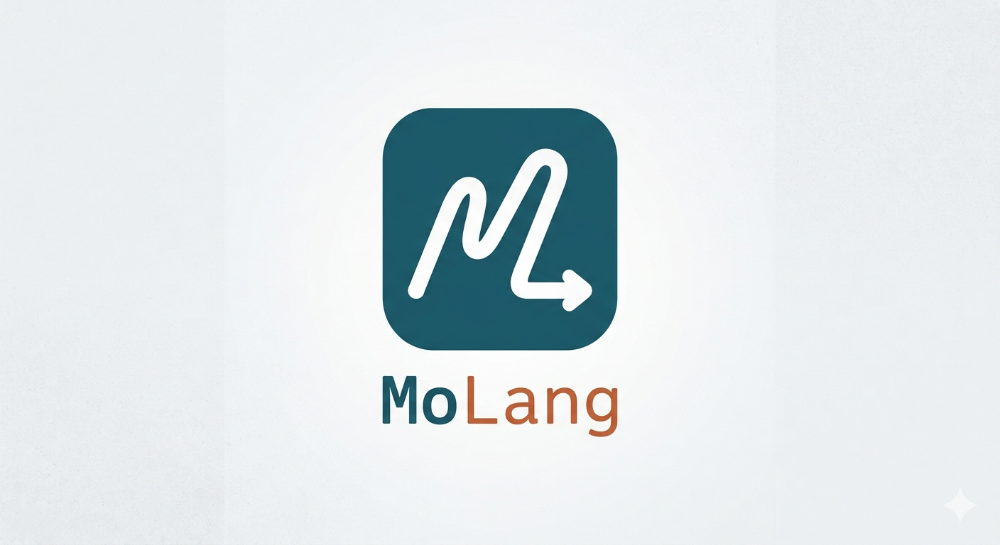
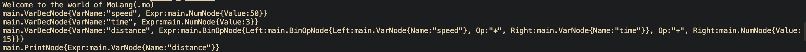

# MoLang (.mo)



MoLang is a small toy programming language written from scratch in Go. Its
syntax is inspired by simple Hindi words:

- `yaha` declares a variable
- `dikhao` prints a value
- `+`, `-`, `*`, and `/` perform basic calculations

The project is being built step by step with a custom lexer, parser, and
execution environment. No external language framework is required.

## Example

The intended MoLang syntax looks like this:

```molang
yaha x = 10
yaha y = 5
dikhao(x + y)
```

This program declares two variables and prints their sum.

## Language Basics

### Variables

Use `yaha` followed by a variable name, `=`, and a number:

```molang
yaha age = 20
```

Variables can use letters, numbers, and underscores, but must start with a
letter or underscore.

### Printing

Use `dikhao(...)` to print a number, string, variable, or calculation:

```molang
dikhao(10)
dikhao(10 * 2 + 3)
```

### Calculations

MoLang supports these arithmetic operators:

```text
+  addition
-  subtraction
*  multiplication
/  division
```

Parentheses can be used to group calculations:

```molang
dikhao((10 + 5) * 2)
```

## How It Works

MoLang is organized into these stages:

1. **Lexer** (`lexer/`): converts source code into tokens such as keywords,
   identifiers, numbers, operators, and parentheses.
2. **Parser** (`parser/`): checks the token sequence and builds the AST.
3. **Interpreter** (`interpreter/`): stores variables and evaluates statements.
4. **AST** (`ast/`): contains the shared syntax tree node definitions.

The lexer currently defines token types for `yaha`, `dikhao`, identifiers,
numbers, assignment, arithmetic operators, parentheses, new lines, and end of
file.

## Run the Project

Make sure Go is installed, then run:

```bash
go run . main.mo
```

The CLI reads a `.mo` file and passes it through the lexer, parser, and
interpreter packages.

## Current status

- At this point of time , the program takes the .mo file and produces token out of it, parse it and produces AST nodes sucessfully





## Future Goals
- [x] AST
- [x] Execution logic
- [ ] Add automated lexer, parser, and interpreter tests
- [ ] Add strict type checking
- [ ] Support `if`/`else` statements
- [ ] Implement operator precedence
- [ ] Add `for` loops
- [ ] functions `func ()`
- [ ] Syntax highlighting in VS Code

## Project Goal

MoLang is an educational project for understanding how programming languages
work internally, from reading source text to executing instructions.